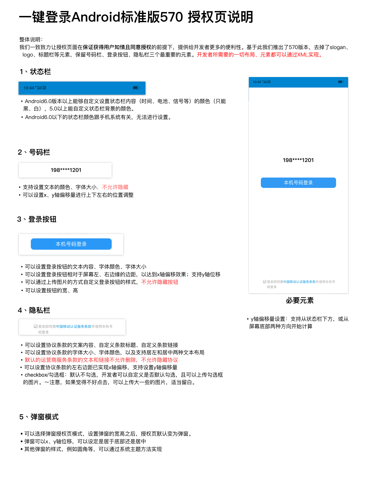

# 1. 开发环境配置

sdk技术问题沟通QQ群：609994083</br>
sdk支持版本：Android4.0以上</br>
本文档为一键登录SDK5.8.1版本的开发文档</br>

**注意事项：**

1. **一键登录服务必须打开蜂窝数据流量并且手机操作系统给予应用蜂窝数据权限才能使用**
2. **取号请求过程需要消耗用户少量数据流量（国外漫游时可能会产生额外的费用）**
3. **一键登录服务目前支持中国移动2/3/4G（2,3G因为无线网络环境问题，时延和成功率会比4G低） 和中国电信4G、中国联通4G（如有更新会在技术沟通QQ群上通知）**

## 1.1. 接入流程

**1.申请appid和appkey**

根据《开发者接入流程文档》，前往中国移动开发者社区（dev.10086.cn)，按照文档要求创建开发者账号并申请appid和appkey，并填写应用的包名和包签名。

**2.申请能力**

应用创建完成后，在页面左侧选择一键登录能力，配置应用服务器出口IP地址及验签方式。

## 1.2. 开发流程

**第一步：下载SDK及相关文档**

请在开发者群或官网下载最新的SDK包

**第二步：搭建开发环境**

jar包集成方式：

1. 在Eclipse/AS中建立你的工程。 
2. 将`*.jar`拷贝到工程的libs目录下，如没有该目录，可新建。
3. 将sdk所需要的资源文件（anim, drawable, drawable-xxhdpi文件）从demo工程res-umc目录下的文件添加到项目工程中

aar包集成方式：

1. 在Eclipse/AS中建立你的工程。 
2. 将`*.aar`拷贝到工程的libs目录下，如没有该目录，可新建。
3. 在app的build.gradle文件添加implementation(name:'CMCCSSOSDK-release',ext:'aar')

**第三步：开始使用移动认证SDK**

**[1] AndroidManifest.xml设置**

添加必要的权限支持: 

```java
<uses-permission android:name="android.permission.INTERNET" />
<uses-permission android:name="android.permission.ACCESS_WIFI_STATE" />
<uses-permission android:name="android.permission.ACCESS_NETWORK_STATE" />
<uses-permission android:name="android.permission.CHANGE_NETWORK_STATE" />
```

建议的权限：

```java
<uses-permission android:name="android.permission.READ_PHONE_STATE" />
```

**强烈建议开发者申请本权限，本权限主要用于在双卡情况下，更精准的获取数据流量卡的运营商类型，缺少该权限，存在取号失败概率上升的风险。**同时，向用户申请此权限时，请按照国家相关法规向用户说明权限的用途，尊重用户个人隐私。

权限说明：

| 权限                 | 说明                                       |
| -------------------- | ------------------------------------------ |
| INTERNET             | 允许应用程序联网，用于访问网关和认证服务器 |
| READ_PHONE_STATE     | 获取imsi用于判断双卡和换卡                 |
| ACCESS_WIFI_STATE    | 允许程序访问WiFi网络状态信息               |
| ACCESS_NETWORK_STATE | 获取网络状态，判断是否数据、wifi等         |
| CHANGE_NETWORK_STATE | 允许程序改变网络连接状态                   |

**[2] 配置授权登录activity**

开发者根据需要配置横竖屏方向：`android:screenOrientation`
示列代码为`unspecified`（默认值由系统选择显示方向）

```java
<activity
    android:name="com.cmic.sso.sdk.activity.LoginAuthActivity"
    android:configChanges="orientation|keyboardHidden|screenSize"
    android:screenOrientation="unspecified"
    android:launchMode="singleTop">
</activity>
```

通过以上两个步骤，工程就已经配置完成了。接下来就可以在代码里使用移动认证的SDK进行开发了

**[3] 创建一个AuthnHelper实例**

`AuthnHelper`是SDK的功能入口，所有的接口调用都得通过AuthnHelper进行调用。因此，调用SDK，首先需要创建一个AuthnHelper实例

**方法原型：**

```java
public static AuthnHelper getInstance(Context context)
```

**参数说明：**

| 参数      | 类型      | 说明                              |
| ------- | ------- | ------------------------------- |
| context | Context | 调用者的上下文环境，其中activity中this即可以代表。 |

**示例代码：**

```java
public void onCreate(Bundle savedInstanceState) {
    super.onCreate(savedInstanceState);
    mContext = this;    
    ……
    mAuthnHelper = AuthnHelper.getInstance(mContext);
    }
```

**[4] 实现回调**

所有的SDK接口调用，都会传入一个回调，用于接收SDK返回的调用结果。结果以`JsonObject`的形式传递，`TokenListener`的实现示例代码如下：

```java
mListener = new TokenListener() {
    @Override
    public void onGetTokenComplete(int SDKRequestCode, JSONObject jObj) {
        if (jObj != null) {
            mResultString = jObj.toString();
            mHandler.sendEmptyMessage(RESULT);
            if (jObj.has("token")) {
                mtoken = jObj.optString("token");
            }
        }
    }
};
```

**[5] 混淆策略**

请避免混淆一键登录SDK，在Proguard混淆文件中增加以下配置：

```java
-dontwarn class com.cmic.sso.sdk.**
-keep class com.cmic.sso.sdk.**{*;}
```

<div STYLE="page-break-after: always;"></div>

# 2. 一键登录功能

## 2.1. 准备工作

在中国移动开发者社区进行以下操作：

1. 获得appid和appkey、APPSecret（服务端）；
2. 勾选一键登录能力；
3. 配置应用服务器的出口ip地址
4. 配置公钥（如果使用RSA加密方式）
5. <font color="red">商务对接签约（未签约应用使用体验版套餐，每个appid每天只能调用1000次，三个月到期）</font>

## 2.2. 使用流程说明


## 2.3. 取号请求

本方法用于发起取号请求，SDK完成网络判断、蜂窝数据网络切换等操作并缓存凭证scrip。<font color="red">缓存允许用户在未开启蜂窝网络时成功取号。</font>

取号接口使用http请求，开发者需按照安卓网络安全配置适配。

Android P及以上可降低targetSdkVersion版本，或在res的xml目录下，新建一个xml文件(名称自定义,如：network_security_config.xml)

```java
<?xml version="1.0" encoding="utf-8"?>
<network-security-config>    
	<base-config cleartextTrafficPermitted="true" />
</network-security-config>
```

并在manifest清单文件配置

```java
<application
	...
    android:networkSecurityConfig="@xml/network_security_config"
    ...    
/>
```

**取号方法原型：**

```java
public void getPhoneInfo(final String appId, 
                         final String appKey,
                         final TokenListener listener,
                         final int requestCode)
```

**参数说明：**

| 参数        | 类型          | 说明                                                         |
| :---------- | :------------ | :----------------------------------------------------------- |
| appId       | String        | 应用的AppID                                                  |
| appkey      | String        | 应用密钥                                                     |
| listener    | TokenListener | TokenListener为回调监听器，是一个java接口，需要调用者自己实现；TokenListener是接口中的认证登录token回调接口，OnGetTokenComplete是该接口中唯一的抽象方法，即void OnGetTokenComplete(JSONObject  jsonobj) |
| requestCode | String           | 请求标识码。与响应参数中的SDKRequestCode呼应，SDKRequestCode=用户传的requestCode，如果开发者没有传requestCode，那么SDKRequestCode=-1 |

**响应参数**

OnGetTokenComplete的参数JSONObject，含义如下：

| 字段           | 类型    | 含义                                                         |
| -------------- | ------- | ------------------------------------------------------------ |
| resultCode     | String     | 接口返回码，“103000”为成功。具体返回码见5.1 SDK返回码        |
| desc/resultString/resultDesc           | String | 成功标识，true为成功。                                       |
| traceId        | String  | 主要用于定位问题                                             |

**示例代码：**

```java
/***
判断和获取READ_PHONE_STATE权限逻辑
***/   

//创建AuthnHelper实例
public void onCreate(Bundle savedInstanceState) {
    super.onCreate(savedInstanceState);
    mContext = this;    
    ……
    mAuthnHelper = AuthnHelper.getInstance(mContext);
    }

//实现取号回调
mListener = new TokenListener() {
    @Override
    public void onGetTokenComplete(JSONObject jObj) {
        …………	// 应用接收到回调后的处理逻辑
    }
};

//调用取号方法
mAuthnHelper.getPhoneInfo(Constant.APP_ID, Constant.APP_KEY, mListener，requestCode);
```


## 2.4. 授权请求

应用调用本方法时，SDK将拉起用户授权页面，用户确认授权后，SDK将返回token给应用客户端。可通过返回码200087监听授权页是否成功拉起。

**授权请求方法原型**

```java
public void loginAuth(final String appId, 
                      final String appKey, 
                      final TokenListener listener
                      final int requestCode)
```

**请求参数**

| 参数          | 类型            | 说明                                       |
| :---------- | :------------ | :--------------------------------------- |
| appId       | String        | 应用的AppID                                 |
| appkey      | String        | 应用密钥                                     |
| listener    | TokenListener | TokenListener为回调监听器，是一个java接口，需要调用者自己实现；TokenListener是接口中的认证登录token回调接口，OnGetTokenComplete是该接口中唯一的抽象方法，即void OnGetTokenComplete(JSONObject  jsonobj) |
| requestCode | String           | 请求标识码。与响应参数中的SDKRequestCode呼应，SDKRequestCode=用户传的requestCode，如果开发者没有传requestCode，那么SDKRequestCode=-1 |

**响应参数**

OnGetTokenComplete的参数JSONObject，含义如下：

| 字段           | 类型   | 含义                                                         |
| -------------- | ------ | ------------------------------------------------------------ |
| resultCode     | String    | 接口返回码，“103000”为成功。具体响应码见5.1 SDK返回码        |
|  desc/resultString/resultDesc         | String | 失败时返回：返回错误码说明                                   |
| authType       | String | 认证类型：</br>0:其他；</br>1:WiFi下网关鉴权；</br>2:网关鉴权； |
| authTypeDes | String | 认证类型描述，对应authType                                   |
| token          | String | 成功时返回：临时凭证，token有效期2min，一次有效；同一用户（手机号）10分钟内获取token且未使用的数量不超过30个 |
| traceId | string | 主要用于定位问题                                             |

**示例代码**

```java
//创建AuthnHelper实例
public void onCreate(Bundle savedInstanceState) {
    super.onCreate(savedInstanceState);
    mContext = this;    
    ……
    mAuthnHelper = AuthnHelper.getInstance(mContext);
    }

//实现取号回调
mListener = new TokenListener() {
    @Override 
    public void onGetTokenComplete(JSONObject jObj) {
        …………	// 应用接收到回调后的处理逻辑
    }
};

//调用一键登录方法
mAuthnHelper.loginAuth(Constant.APP_ID, Constant.APP_KEY, mListener，requestCode);
```

**授权页面的回调方法**

| 方法名         | 说明                         |
| -------------- | ---------------------------- |
| pageInListener | 可以获得授权页面是否成功回调 |

**示例代码**

```java
mAuthnHelper.setPageInListener(new LoginPageInListener() {
            @Override
            public void onLoginPageInComplete(String resultCode, JSONObject jsonObj) {
                if(resultCode.equals("200087")){
                    Log.d("initSDK","page in---------------");
                }
            }
        });
```


## 2.5. 授权页面设计

为了确保用户在登录过程中将手机号码信息授权给开发者使用的知情权，一键登录需要开发者提供授权页登录页面供用户授权确认。开发者在调用授权登录方法前，必须弹出授权页，明确告知用户当前操作会将用户的本机号码信息传递给应用。

### 2.5.1. 页面规范细则



**注意：**

**1、开发者不得通过任何技术手段，破解授权页，或将授权页面的号码栏、隐私栏、品牌露出内容隐藏、覆盖。**

**2、登录按钮文字描述必须包含“登录”或“注册”等文字，不得诱导用户授权。**

**3、对于接入移动认证SDK并上线的应用，我方会对上线的应用授权页面做审查，如果有出现未按要求弹出或设计授权页面的，将关闭应用的认证取号服务。**


### 2.5.2. 修改页面主题

开发者可以通过`setAuthThemeConfig`方法修改授权页面主题

**方法原型：**

```java
public void setAuthThemeConfig(AuthThemeConfig authThemeConfig)
```

**参数说明**

| 参数            | 类型            | 说明                                                         |
| :-------------- | :-------------- | :----------------------------------------------------------- |
| AuthThemeConfig | authThemeConfig | 主题配置对象，由AuthThemeConfig.Builder().build()创建，开发者通过对builder中调用对应的方法配置授权页中对应的元素 |

**AuthThemeConfig.java配置元素说明：**

**状态栏**

| 方法         | 说明                                                         |
| ------------ | ------------------------------------------------------------ |
| setStatusBar | 设置状态栏颜色（系统版本5.0以上可设置）、字体颜色（系统版本6.0以上可设置黑色、白色）。 |

**服务条款导航栏**

| 方法                 | 说明                           |
| -------------------- | ------------------------------ |
| setNavTextColor      | 设置服务条款标题字体颜色       |
| setNavColor      | 设置服务条款标题颜色       |
| setNavTextSize       | 设置服务条款标题字体大小       |
| setClauseLayoutResID | 设置服务条款标题布局资源文件ID（包括返回按钮） |

**授权页布局**

| 方法               | 说明                   |
| ------------------ | ---------------------- |
| setAuthContentView | 设置授权页布局显示View |
| setAuthLayoutResID | 设置授权页布局文件ID   |

**安卓底部导航栏自适应**

| 方法                 | 说明                                                         |
| -------------------- | ------------------------------------------------------------ |
| setFitsSystemWindows | 开启安卓底部导航栏自适应，开启后，导航栏唤起时，授权页面元素也会相对变化；不开启自适应，自定义内容可以铺满全屏，设置状态栏透明后，可以达到沉浸式显示效果。0-开启自适应，1-关闭自适应，默认开启。 |

**授权页号码栏**

| 方法                 | 说明                                |
| -------------------- | ----------------------------------- |
| setNumberColor       | 设置手机号码字体颜色                |
| setNumberSize        | 设置号码栏字体大小、字体粗细        |
| setNumFieldOffsetY   | 设置号码栏相对于状态栏下边缘y偏移   |
| setNumFieldOffsetY_B | 设置号码栏相对于底部y偏移           |
| setNumberOffsetX     | 设置号码栏相对于默认位置的X轴偏移量 |

**授权页登录按钮**

| 方法                   | 说明                                               |
| ---------------------- | -------------------------------------------------- |
| setLogBtnText          | 设置登录按钮文本内容、字体颜色、字体大小、字体粗细 |
| setLogBtnImgPath       | 设置授权登录按钮图片                               |
| setLogBtn              | 设置登录按钮的宽高                                 |
| setLogBtnMargin        | 设置登录按钮相对于屏幕左右边缘边距                 |
| setLogBtnOffsetY       | 设置登录按钮相对于状态栏下边缘y偏移                |
| setLogBtnOffsetY_B     | 设置登录按钮相对于底部y偏移                        |
| setLogBtnClickListener | 设置登录按钮点击监听事件                           |

**授权页隐私栏**

| 方法                | 说明                                               |
| ------------------- | -------------------------------------------------- |
| setPrivacyAlignment | 设置隐私条款的协议文本，自定义条款，自定义条款链接（支持四份条款） |
| setPrivacyText      | 设置隐私条款的字体大小，文本颜色，是否居中。协议标题和其他文案可以分开设置文本颜色 |
| setCheckBoxImgPath  | 设置复选框图片                                     |
| setCheckTipText  | 设置未勾选提示的自定义提示文案。不设置则无提示                          |
| setPrivacyOffsetY   | 设置隐私条款相对于状态栏下边缘y偏移                |
| setPrivacyOffsetY_B | 设置隐私条款相对于底部y偏移                        |
| setPrivacyMargin    | 设置隐私条款距离手机左右边缘的边距                 |
| setPrivacyState     | 设置是否默认勾选复选框                             |
| setPrivacyBookSymbol | 设置书名号，0=设置，1=不设置，默认设置 |
| setCheckBoxLocation | 设置复选框相对右侧协议文案居上或者居中，默认居上。0-居上，1-居中 |


**授权页转场动画**

| 方法              | 说明               |
| ----------------- | ------------------ |
| setAuthPageActIn  | 设置授权页进场动画 |
| setAuthPageActOut | 设置授权页出场动画 |

**弹窗模式**

| 方法                    | 说明                                                         |
| ----------------------- | ------------------------------------------------------------ |
| setAuthPageWindowMode   | 设置授权页窗口宽高比例                                       |
| setAuthPageWindowOffset | 设置授权页窗口X轴Y轴偏移                                     |
| setWindowBottom         | 设置授权页是否居于底部，0=居中；1=底部，设置为1Y轴的偏移失效 |
| setThemeId              | 设置授权页弹窗主题，也可在Manifest设置                       |

**授权页语言切换**

| model属性       | 属性说明                   |
| :-------------- | :------------------------- |
| appLanguageType | 0.中文简体1.中文繁体2.英文 |


**返回键监听**

| 方法                    | 说明                                                         |
| ----------------------- | ------------------------------------------------------------ |
| setBackPressedListener   | 设置授权页返回键监听事件                                       |
| setCheckBoxListener | 设置授权页勾选框和登录按钮的监听事件 |


### 2.5.3. finish授权页

SDK完成回调后，**不会立即关闭授权页面**，需要开发者主动调用离开授权页面方法去完成页面的关闭

方法原型

```java
public void quitAuthActivity(){} 
```


## 2.6. 获取手机号码（服务端）

详细请开发者查看移动认证服务端接口文档说明。


# 3. 本机号码校验

## 3.1. 准备工作

在中国移动开发者社区进行以下操作：

1. 获得appid和appkey、APPSecret（服务端）；
2. 勾选一键登录能力；
3. 配置应用服务器的出口ip地址
4. 配置公钥（如果使用RSA加密方式）
5. <font color="red">商务对接签约（未签约应用使用体验版套餐，每个appid每天只能调用1000次，三个月到期）</font>

## 3.2. 使用流程说明


## 3.3. 取号请求

详情可参考一键登录的取号请求说明（2.3章）


## 3.4. 本机号码校验请求token

开发者可以在应用内部任意页面调用本方法，获取本机号码校验的接口调用凭证（token）

**本机号码校验方法原型**

```java
public void mobileAuth(final String appId, 
                       final String appKey, 
                       final TokenListener listener,
                       final int requestCode)
```

**请求参数说明：**

| 参数          | 类型            | 说明                                       |
| :---------- | :------------ | :--------------------------------------- |
| appId       | String        | 应用的AppID                                 |
| appkey      | String        | 应用密钥                                     |
| listener    | TokenListener | TokenListener为回调监听器，是一个java接口，需要调用者自己实现；TokenListener是接口中的认证登录token回调接口，OnGetTokenComplete是该接口中唯一的抽象方法，即void OnGetTokenComplete(JSONObject  jsonobj) |
| requestCode | String           | 请求标识码。与响应参数中的SDKRequestCode呼应，SDKRequestCode=用户传的requestCode，如果开发者没有传requestCode，那么SDKRequestCode=-1 |

**响应参数：**

OnGetTokenComplete的参数JSONObject，含义如下：

| 字段           | 类型   | 含义                                                         |
| -------------- | ------ | ------------------------------------------------------------ |
| resultCode     | String    | 接口返回码，“103000”为成功。具体响应码见5.1 SDK返回码        |
| authType       | String    | 登录类型。                                                   |
| authTypeDes    | String | 登录类型中文描述。                                           |
| token          | String | 成功返回:临时凭证，token有效期2min，一次有效，同一用户（手机号）10分钟内获取token且未使用的数量不超过30个 |
| traceId       | String | 主要用于定位问题                                             |

**示例代码:**

```java
//创建AuthnHelper实例
public void onCreate(Bundle savedInstanceState) {
    super.onCreate(savedInstanceState);
    mContext = this;    
    ……
    mAuthnHelper = AuthnHelper.getInstance(mContext);
    }

//实现校验回调
mListener = new TokenListener() {
    @Override
    public void onGetTokenComplete(JSONObject jObj) {
        …………	// 应用接收到回调后的处理逻辑
    }
};

//调用本机号码校验方法
mAuthnHelper.mobileAuth(APP_ID, APP_KEY, mListener);
```

## 3.5. 本机号码校验（服务端）

详细请开发者查看移动认证服务端接口文档说明。


# 4. 其它SDK请求方法

## 4.1. 获取网络状态和运营商类型

本方法用于获取用户当前的网络环境和运营商

**原型**

```java
public JSONObject getNetworkType(Context context)
```

**请求参数**

| 参数      | 类型      | 说明    |
| ------- | ------- | ----- |
| context | Context | 上下文对象 |

**响应参数**

参数JSONObject，含义如下：

| 参数           | 类型     | 说明                                       |
| ------------ | ------ | ---------------------------------------- |
| operatorType | String | 运营商类型：</br>1.移动流量；</br>2.联通流量；</br>3.电信流量 |
| networkType  | String | 网络类型：</br>0.未知；</br>1.流量；</br>2.wifi；</br>3.数据流量+wifi |

## 4.2. 删除临时取号凭证

开发者取号或者授权成功后，SDK将取号的一个临时凭证缓存在本地，缓存允许用户在未开启蜂窝网络时成功取号。开发者可以使用本方法删除该缓存凭证。

**原型**

```java
public void delScrip()
```

## 4.3.设置取号超时

设置取号超时时间，默认为8000毫秒。

开发者设置取号请求方法（getPhoneInfo）、授权请求方法（loginAuth），本机号码校验请求token方法（mobileAuth）的超时时间。开发者在使用SDK方法前，可以通过本方法设置将要使用的方法的超时时间。

**原型**

```java
public void setOverTime(long overTime)
```

**请求参数**

| 参数     | 类型 | 说明                       |
| -------- | ---- | -------------------------- |
| overTime | long | 设置超时时间（单位：毫秒） |

**响应参数**

无


# 5. 返回码说明


| 返回码 | 返回码描述                                                   |
| ------ | ------------------------------------------------------------ |
| 103000 | 成功                                                         |
| 102507 | 登录超时（授权页点登录按钮时）                               |
| 103101 | 请求签名错误（若发生在客户端，可能是appkey传错，可检查是否跟appsecret弄混，或者有空格。若发生在服务端接口，需要检查验签方式是MD5还是RSA，如果是MD5，则排查signType字段，若为appsecret，需确认是否误用了appkey生签。如果是RSA，需要检查使用的私钥跟报备的公钥是否对应和报文拼接是否符合文档要求。）            |
| 103102 | 包签名错误（社区填写的appid和对应的包名包签名必须一致）      |
| 103111 |网关IP错误（检查是否开了vpn或者境外ip） |
| 103119 | appid不存在（检查传的appid是否正确或是否有空格）          |
| 103211 |其他错误，（常见于报文格式不对，先请检查是否符合这三个要求：a、json形式的报文交互必须是标准的json格式；b、发送时请设置content type为 application/json；c、参数类型都是String。如有需要请联系qq群609994083内的移动认证开发）       |
| 103412 | 无效的请求（1.加密方式错误；2.非json格式；3.空请求等）       |
| 103414 | 参数校验异常                                                 |
| 103511 | 服务器ip白名单校验失败                                       |
| 103811 | token为空                                                    |
| 103902 |scrip失效（客户端高频调用请求token接口）        |
| 103911 | token请求过于频繁，10分钟内获取token且未使用的数量不超过30个 |
| 104201 | token已失效或不存在（重复校验或失效）                        |
| 105001 | 联通取号失败                                                 |
| 105002 | 移动取号失败（一般是物联网卡）                            |
| 105003 | 电信取号失败                                                 |
| 105012 | 不支持电信取号                                               |
| 105013 | 不支持联通取号                                               |
| 105018 | token权限不足（使用了本机号码校验的token获取号码） |
| 105019 | 应用未授权（未在开发者社区勾选能力）               |
| 105021 | 当天已达取号限额                                   |
| 105302 | appid不在白名单                                    |
| 105312 | 余量不足（体验版到期或套餐用完）                   |
| 105313 | 非法请求                                           |
| 200005 | 用户未授权（READ_PHONE_STATE）                     |
| 200010 | 无法识别sim卡或没有sim卡（android）                |
| 200020 | 授权页关闭                                         |
| 200021 | 数据解析异常（一般是卡欠费）                         |
| 200022 | 无网络                                             |
| 200023 | 请求超时                                           |
| 200024 | 数据网络切换失败                                   |
| 200025 | 其他错误（socket、系统未授权数据蜂窝权限等，如需要协助，请加入qq群发问） |
| 200026 | 输入参数错误                                       |
| 200027 | 未开启数据网络或网络不稳定                         |
| 200028 | 网络异常                                           |
| 200038 | 异网取号网络请求失败                               |
| 200039 | 异网取号网关取号失败                               |
| 200040 | UI资源加载异常                                     |
| 200048 | 用户未安装sim卡                                    |
| 200050 | EOF异常                                            |
| 200072 | CA根证书校验失败                                   |
| 200080 | 本机号码校验仅支持移动手机号                       |
| 200082 | 服务器繁忙                                         |
| 200087 | 授权页成功调起                                     |

# 6. 常见问题

产品简介

1. 一键登录与本机号码校验的区别？
   - 一键登录有授权页面，开发者经用户授权后可获得号码，适用于注册/登录场景；本机号码校验不返回号码，仅返回待校验号码是否本机的校验结果，适用于所有基于手机号码进行风控的场景。
2. 一键登录支持哪些运营商？
   - 一键登录目前支持移动、联通、电信三网运营商
3. 移动认证是否支持小程序和H5？
   - 暂不支持
4. 移动认证对于携号转网的号码，是否还能使用？
   - 移动认证SD不提供判断用户是否为携号转网的Api，但提供判断用户当前流量卡运营商的方法。即携号转网的用户仍然能够使用移动认证
5. 移动认证的原理？
   - 通过运营商数据网关获取当前流量卡的号码
6. 一键登录是否支持多语言？
   - 暂不支持
7. 一键登录是否具备用户取号频次限制？
   - 对获取token的频次有限制，同一用户（手机号）10分钟内获取token且未使用的数量不超过30个

能力申请

1. 注册邮件无法激活
   - 由于各公司企业邮箱的限制，请尽量不使用企业邮箱注册，更换其他邮箱尝试；如无法解决问题，需发邮件至平台客服邮件激活：kfptfw@aspirecn.com
2. 服务器IP白名单填写有没有要求？
   - 业务侧服务器接口到移动认证接口访问时，会校验请求服务器的IP地址，防止业务侧用户信息被盗用风险。IP白名单目前同时支持IPv4和IPv6，支持最大4000字符，并支持配置IP段。
3. 安卓和苹果能否使用一个AppID？
   - 需分开创建appid
4. 包签名修改问题？
   - 包名和包签名提交后不支持修改，建议直接新建应用
5. 包签名不一致会有哪些影响？
   - SDK会无法使用

SDK使用问题：

1. 最新的移动服务条款在哪里查询？
   - 最新的授权条款请见：https://wap.cmpassport.com/resources/html/contract.html 
2. 用户点击授权后，授权页会自动关闭吗？
   - 不能，需要开发者调用一下dissmiss，详情见【finish授权页】章节
3. 同一个token可以多次获取手机号码吗？
   - token是单次有效的，一个token最多只能获取一次手机号。
4. 如何判断调用方法是否成功？
   - 方法调用后SDK会给出返回码，103000为成功，其余为调用失败。建议应用捕捉这些返回码，可用于日常数据分析。


如果未能解决您的问题，请加入sdk技术问题沟通QQ群：609994083。
