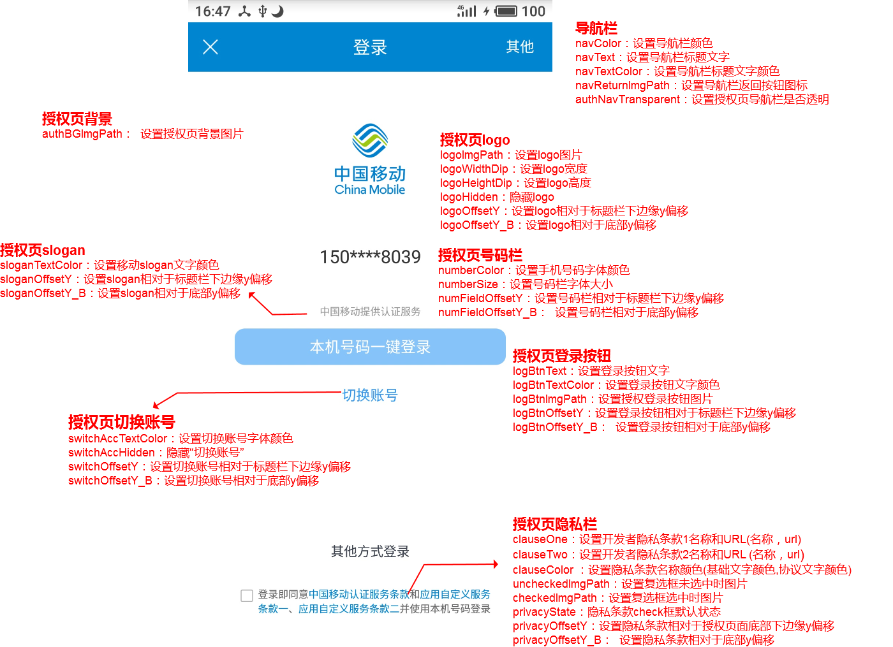
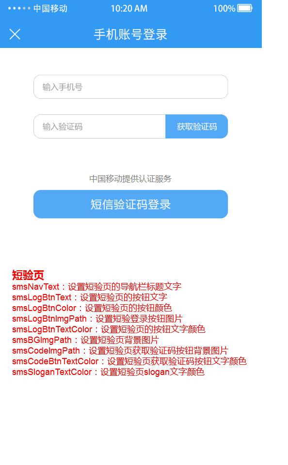
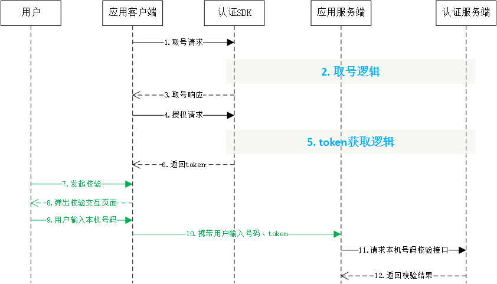

# 1. 开发环境配置

sdk技术问题沟通QQ群：609994083</br>
sdk支持版本：Android4.0以上</br>
本文档为一键登录SDK5.6.5版本的开发文档</br>

**注意事项：**

1. **认证取号服务必须打开蜂窝数据流量并且手机操作系统给予应用蜂窝数据权限才能使用**
2. **取号请求过程需要消耗用户少量数据流量（国外漫游时可能会产生额外的费用）**
3. **认证取号服务目前支持中国移动2/3/4G和中国电信4G**

## 1.1. 接入流程

**1.申请appid和appkey**

根据《开发者接入流程文档》，前往中国移动开发者社区（dev.10086.cn)，按照文档要求创建开发者账号并申请appid和appkey，并填写应用的包名和包签名。

**2.申请能力**

应用创建完成后，在能力配置页面上，勾选应用需要接入的能力类型，如一键登录，并配置应用的服务器出口IP地址。（如果在服务端需要用非对称加密方法对一些重要信息进行加密处理，请在能力配置页面填写RSA加密的公钥）

## 1.2. 开发流程

**第一步：下载SDK及相关文档**

请在开发者群或官网下载最新的SDK包

**第二步：搭建开发环境**

jar包集成方式：

1. 在Eclipse/AS中建立你的工程。 
2. 将`*.jar`拷贝到工程的libs目录下，如没有该目录，可新建。
3. 将sdk所需要的资源文件（anim, drawable, drawable-xxhdpi文件）从demo工程res-umc目录下的文件添加到项目工程中

aar包集成方式：

1. 在Eclipse/AS中建立你的工程。 
2. 将`*.aar`拷贝到工程的libs目录下，如没有该目录，可新建。


**第三步：开始使用移动认证SDK**

**[1] AndroidManifest.xml设置**

添加必要的权限支持: 

```java
<uses-permission android:name="android.permission.INTERNET" />
<uses-permission android:name="android.permission.READ_PHONE_STATE" />
<uses-permission android:name="android.permission.ACCESS_WIFI_STATE" />
<uses-permission android:name="android.permission.ACCESS_NETWORK_STATE" />
<uses-permission android:name="android.permission.CHANGE_NETWORK_STATE" />
```

权限说明：

| 权限                   | 说明                    |
| -------------------- | --------------------- |
| INTERNET             | 允许应用程序联网，用于访问网关和认证服务器 |
| READ_PHONE_STATE     | 获取imsi用于判断双卡和换卡       |
| ACCESS_WIFI_STATE    | 允许程序访问WiFi网络状态信息      |
| ACCESS_NETWORK_STATE | 获取网络状态，判断是否数据、wifi等   |
| CHANGE_NETWORK_STATE | 允许程序改变网络连接状态          |

**[2] 配置授权登录activity**

开发者根据需要配置横竖屏方向：`android:screenOrientation`
示列代码为`unspecified`（默认值由系统选择显示方向）

```java
<activity
    android:name="com.cmic.sso.sdk.activity.OAuthActivity"
    android:configChanges="orientation|keyboardHidden|screenSize"
    android:screenOrientation="unspecified"
    android:launchMode="singleTop">
</activity>
<!-- required -->
<activity
    android:name="com.cmic.sso.sdk.activity.LoginAuthActivity"
    android:configChanges="orientation|keyboardHidden|screenSize"
    android:screenOrientation="unspecified"
    android:launchMode="singleTop">
</activity>
```

通过以上两个步骤，工程就已经配置完成了。接下来就可以在代码里使用移动认证的SDK进行开发了

**[3] 创建一个AuthnHelper实例**

`AuthnHelper`是SDK的功能入口，所有的接口调用都得通过AuthnHelper进行调用。因此，调用SDK，首先需要创建一个AuthnHelper实例

**方法原型：**

```java
public static AuthnHelper getInstance(Context context)
```

**参数说明：**

| 参数      | 类型      | 说明                              |
| ------- | ------- | ------------------------------- |
| context | Context | 调用者的上下文环境，其中activity中this即可以代表。 |

**示例代码：**

```java
public void onCreate(Bundle savedInstanceState) {
    super.onCreate(savedInstanceState);
    mContext = this;    
    ……
    mAuthnHelper = AuthnHelper.getInstance(mContext);
    }
```

**[4] 实现回调**

所有的SDK接口调用，都会传入一个回调，用于接收SDK返回的调用结果。结果以`JsonObject`的形式传递，`TokenListener`的实现示例代码如下：

```java
mListener = new TokenListener() {
    @Override
    public void onGetTokenComplete(JSONObject jObj) {
        if (jObj != null) {
            mResultString = jObj.toString();
            mHandler.sendEmptyMessage(RESULT);
            if (jObj.has("token")) {
                mtoken = jObj.optString("token");
            }
        }
    }
};
```

**[5] 混淆策略**

请避免混淆一键登录SDK，在Proguard混淆文件中增加以下配置：

```java
-dontwarn class com.cmic.sso.sdk.**
-keep class com.cmic.sso.sdk.**{*;}
```

<div STYLE="page-break-after: always;"></div>

# 2. 一键登录功能

## 2.1. 准备工作

在中国移动开发者社区进行以下操作：

1. 获得appid和appkey、APPSecret（服务端）；
2. 勾选一键登录能力；
3. 配置应用服务器的出口ip地址
4. 配置公钥（如果使用RSA加密方式）

## 2.2. 使用流程说明


## 2.3. 取号请求

本方法用于发起取号请求，SDK完成网络判断、蜂窝数据网络切换等操作并缓存凭证scrip。

**取号方法原型：**

```java
public void getPhoneInfo(final String appId, 
                         final String appKey, 
                         final long expiresIn, 
                         final TokenListener listener,
                         final int requestCode)
```

**参数说明：**

| 参数          | 类型            | 说明                                       |
| :---------- | :------------ | :--------------------------------------- |
| appId       | String        | 应用的AppID                                 |
| appkey      | String        | 应用密钥                                     |
| expiresIn   | long          | 设置超时时间，单位ms，设置范围2000-8000                |
| listener    | TokenListener | TokenListener为回调监听器，是一个java接口，需要调用者自己实现；TokenListener是接口中的认证登录token回调接口，OnGetTokenComplete是该接口中唯一的抽象方法，即void OnGetTokenComplete(JSONObject  jsonobj) |
| requestCode | int           | 请求标识码。与响应参数中的SDKRequestCode呼应，SDKRequestCode=用户传的requestCode，如果开发者没有传requestCode，那么SDKRequestCode=-1 |

**响应参数**

OnGetTokenComplete的参数JSONObject，含义如下：

| 字段             | 类型      | 含义                                       |
| -------------- | ------- | ---------------------------------------- |
| resultCode     | int     | 接口返回码，“103000”为成功。具体返回码见5.1 SDK返回码       |
| desc           | boolean | 成功标识，true为成功。                            |
| SDKRequestCode | int     | 响应标识码。与请求参数中的requestCode呼应，SDKRequestCode=用户传的requestCode，如果开发者没有传requestCode，那么SDKRequestCode=-1 |

**示例代码：**

```java
/***
判断和获取READ_PHONE_STATE权限逻辑
***/   

//创建AuthnHelper实例
public void onCreate(Bundle savedInstanceState) {
    super.onCreate(savedInstanceState);
    mContext = this;    
    ……
    mAuthnHelper = AuthnHelper.getInstance(mContext);
    }

//实现取号回调
mListener = new TokenListener() {
    @Override
    public void onGetTokenComplete(JSONObject jObj) {
        …………	// 应用接收到回调后的处理逻辑
    }
};

//调用取号方法
mAuthnHelper.getPhoneInfo(Constant.APP_ID, Constant.APP_KEY, 8000, mListener);
```

## 2.4. 使用短信验证码（可选）

SDK提供短信验证码作为网关取号的补充功能，短验功能只有在网关取号失败时才能使用。

**注意：**

1. 目前短信验证码只支持移动和电信手机号码
2. 无网络时，不提供短验服务
3. 未获取`READ_PHONE_STATE`授权时，不提供短验服务

**短信验证码开关原型：**

```java
public void SMSAuthOn(boolean on) 
```

**参数说明：**

| 字段        | 类型      | 含义                                       |
| --------- | ------- | ---------------------------------------- |
| SMSAuthOn | boolean | true:使用SDK提供的短验服务</br>false（默认）:不使用SDK提供的短验服务，此时如果用户点击“切换账号”，SDK将返回200060返回码 |

## 2.5. 授权请求

应用调用本方法时，SDK将拉起用户授权页面，用户确认授权后，SDK将返回token给应用客户端。

**授权请求方法原型**

```java
public void loginAuth(final String appId, 
                      final String appKey, 
                      final TokenListener listener
                      final int requestCode)
```

**请求参数**

| 参数          | 类型            | 说明                                       |
| :---------- | :------------ | :--------------------------------------- |
| appId       | String        | 应用的AppID                                 |
| appkey      | String        | 应用密钥                                     |
| listener    | TokenListener | TokenListener为回调监听器，是一个java接口，需要调用者自己实现；TokenListener是接口中的认证登录token回调接口，OnGetTokenComplete是该接口中唯一的抽象方法，即void OnGetTokenComplete(JSONObject  jsonobj) |
| requestCode | int           | 请求标识码。与响应参数中的SDKRequestCode呼应，SDKRequestCode=用户传的requestCode，如果开发者没有传requestCode，那么SDKRequestCode=-1 |

**响应参数**

OnGetTokenComplete的参数JSONObject，含义如下：

| 字段             | 类型     | 含义                                       |
| -------------- | ------ | ---------------------------------------- |
| resultCode     | Int    | 接口返回码，“103000”为成功。具体响应码见5.1 SDK返回码       |
| resultDesc     | String | 失败时返回：返回错误码说明                            |
| authType       | String | 认证类型：</br>0:其他；</br>1:WiFi下网关鉴权；</br>2:网关鉴权；</br>3:短信上行鉴权；</br>7:短信验证码登录 |
| authTypeDec    | String | 认证类型描述，对应authType                        |
| token          | String | 成功时返回：临时凭证，token有效期2min，一次有效；同一用户（手机号）10分钟内获取token且未使用的数量不超过30个 |
| SDKRequestCode | int    | 响应标识码。与请求参数中的requestCode呼应，SDKRequestCode=用户传的requestCode，如果开发者没有传requestCode，那么SDKRequestCode=-1 |

**示例代码**

```java
/***
判断和获取READ_PHONE_STATE权限逻辑
***/   

//创建AuthnHelper实例
public void onCreate(Bundle savedInstanceState) {
    super.onCreate(savedInstanceState);
    mContext = this;    
    ……
    mAuthnHelper = AuthnHelper.getInstance(mContext);
    }

//实现取号回调
mListener = new TokenListener() {
    @Override
    public void onGetTokenComplete(JSONObject jObj) {
        …………	// 应用接收到回调后的处理逻辑
    }
};

//调用一键登录方法
mAuthnHelper.loginAuth(Constant.APP_ID, Constant.APP_KEY, mListener);
```

## 2.6. 授权页面设计

为了确保用户在登录过程中将手机号码信息授权给开发者使用的知情权，一键登录需要开发者提供授权页登录页面供用户授权确认。开发者在调用授权登录方法前，必须弹出授权页，明确告知用户当前操作会将用户的本机号码信息传递给应用。

### 2.6.1. 页面规范细则






**注意：**

**1、开发者不得通过任何技术手段，破解授权页，或将授权页面的隐私栏、品牌露出内容隐藏、覆盖。**

**2、登录按钮文字描述必须包含“登录”或“注册”等文字，不得诱导用户授权。**

**3、对于接入移动认证SDK并上线的应用，我方会对上线的应用授权页面做审查，如果有出现未按要求弹出或设计授权页面的，将关闭应用的认证取号服务。**

### 2.6.2. 修改页面主题

开发者可以通过`setAuthThemeConfig`方法修改授权页面主题

**方法原型：**

```java
public void setAuthThemeConfig(authThemeConfig authThemeConfig)
```

**参数说明**

| 参数              | 类型              | 说明                                       |
| :-------------- | :-------------- | :--------------------------------------- |
| authThemeConfig | authThemeConfig | 主题配置对象，开发者在authThemeConfig.java类中调用对应的方法配置授权页中对应的元素 |

**authThemeConfig.java配置元素说明：**

**授权页导航栏**

| 方法                 | 说明          |
| ------------------ | ----------- |
| navColor           | 设置导航栏颜色     |
| navText            | 设置导航栏标题文字   |
| navTextColor       | 设置导航栏标题文字颜色 |
| navReturnImgPath   | 设置导航栏返回按钮图标 |
| authNavTransparent | 设置授权页导航栏透明  |

**授权页背景**

| 方法            | 说明        |
| ------------- | --------- |
| authBGImgPath | 设置授权页背景图片 |


**授权页logo**

| 方法          | 说明                                  |
| ------------- | ------------------------------------- |
| logoImgPath   | 设置logo图片                          |
| logoWidthDip  | 设置logo宽度                          |
| logoHeightDip | 设置logo高度                          |
| logoHidden    | 隐藏logo                              |
| logoOffsetY   | 设置logo相对于状态栏下边缘y偏移（DP） |
| logoOffsetY_B | 设置logo相对于底部y偏移               |

**授权页号码栏**

| 方法                | 说明                |
| ----------------- | ----------------- |
| numberColor       | 设置手机号码字体颜色        |
| numberSize        | 设置号码栏字体大小         |
| numFieldOffsetY   | 设置号码栏相对于标题栏下边缘y偏移 |
| numFieldOffsetY_B | 设置号码栏相对于底部y偏移     |

**授权页登录按钮**

| 方法              | 说明                 |
| --------------- | ------------------ |
| logBtnText      | 设置登录按钮文字           |
| logBtnTextColor | 设置登录按钮文字颜色         |
| logBtnImgPath   | 设置授权登录按钮图片         |
| logBtnOffsetY   | 设置登录按钮相对于标题栏下边缘y偏移 |
| logBtnOffsetY_B | 设置登录按钮相对于底部y偏移     |

**切换账号**

| 方法                 | 说明                 |
| ------------------ | ------------------ |
| switchAccTextColor | 设置切换账号字体颜色         |
| switchAccHidden    | 隐藏“切换账号”           |
| switchOffsetY      | 设置切换账号相对于标题栏下边缘y偏移 |
| switchOffsetY_B    | 设置切换账号相对于底部y偏移     |

**授权页隐私栏**

| 方法               | 说明                        |
| ---------------- | ------------------------- |
| clauseOne        | 设置开发者隐私条款1名称和URL(名称，url)  |
| clauseTwo        | 设置开发者隐私条款2名称和URL(名称，url)  |
| clauseColor      | 设置隐私条款名称颜色(基础文字颜色，协议文字颜色) |
| uncheckedImgPath | 设置复选框未选中时图片               |
| checkedImgPath   | 设置复选框选中时图片                |
| privacyOffsetY   | 设置隐私条款相对于标题栏下边缘y偏移        |
| privacyOffsetY_B | 设置隐私条款相对于底部y偏移            |

**授权页slogan**

| 方法              | 说明                   |
| --------------- | -------------------- |
| sloganTextColor | 设置移动slogan文字颜色       |
| sloganOffsetY   | 设置slogan相对于标题栏下边缘y偏移 |
| sloganOffsetY_B | 设置slogan相对于底部y偏移     |

**短验页**

| 方法                  | 说明               |
| ------------------- | ---------------- |
| smsNavTransparent   | 设置短验页导航栏隐藏       |
| smsNavText          | 设置短验页的导航栏标题文字    |
| smsLogBtnText       | 设置短验页的登录按钮文字     |
| smsLogBtnImgPath    | 设置短验登录按钮图片       |
| smsLogBtnTextColor  | 设置短验页的按钮文字颜色     |
| smsBGImgPath        | 设置短验页背景图片        |
| smsCodeImgPath      | 设置短验页获取验证码按钮背景图片 |
| smsCodeBtnTextColor | 设置短验页获取验证码按钮文字颜色 |
| smsSloganTextColor  | 设置短验页slogan文字颜色  |

### 2.6.3. 开发者自定义控件

授权页面允许开发者在授权页面titlebar和body添加自定义的控件

注意：自定义的控件不允许覆盖SDK默认的UI

**控件布局方法原型：**

```java
public AuthnHelper addAuthRegistViewConfig(String viewId, 
                        AuthRegisterViewConfig mAuthRegisterViewConfig)
```

**参数说明**

| 参数                      | 类型                     | 说明                       |
| :---------------------- | :--------------------- | :----------------------- |
| viewId                  | String                 | 开发者自定义控件名称               |
| mAuthRegisterViewConfig | AuthRegisterViewConfig | 配置开发者自定义控件的控件来源、位置和处理逻辑等 |

**每次调用loginAuth授权请求之前，都需初始化一次AuthRegisterViewConfig,因为在授权页关闭时都会清空注入进去的AuthRegisterViewConfig,具体实现请见demo工程**</br>
初始化AuthRegisterViewConfig类时需要先调静态内部类Builder()里面的3个方法：

**setView：** 开发者传入自定义的控件，开发者需要提前设置好控件的布局属性，SDK只支持RelativeLayout布局

*setView原型：*

```java
public Builder setView(View view) 
```


**setRootViewId：** 设置控件的位置，目前SDK授权页允许在2个位置插入开发者控件

1. RootViewId.ROOT_VIEW_ID_TITLE_BAR，标题栏
2. RootViewId.ROOT_VIEW_ID_BODY，授权页空白处

*setRootViewId原型：*

```java
public Builder setRootViewId(int rootViewId) 
```


**setCustomInterface：** 设置控件事件        

*setCustomInterface原型：*                                     

```java
public Builder setCustomInterface(CustomInterface customInterface)
```


```java
//开发者自定义控件，myThirdLoginView
private View myThirdLoginView = new LinearLayout(getContext());
mAuthnHelper.addAuthRegistViewConfig("layout_third_login", new AuthRegisterViewConfig.Builder()
        .setView(myThirdLoginView)
        .setRootViewId(AuthRegisterViewConfig.RootViewId.ROOT_VIEW_ID_BODY)
        .setCustomInterface(new CustomInterface() {
            @Override
            public void onClick(Context context) {
                Toast.makeText(context, "动态注册的按钮", Toast.LENGTH_SHORT).show();
            }
        })
        .build()
);
```
**获取token成功之后，需把通过setView()注入进去的view置为null。**

### 2.6.4. finish授权页

SDK完成回调后，**不会立即关闭授权页面**，需要开发者主动调用离开授权页面方法去完成页面的关闭

方法原型

```java
public void quitAuthActivity(){} 
```


### 2.6.5. finish短验页

SDK完成回调后，不会立即关闭短验页面，需要开发者主动调用离开授权页面方法去完成页面的关闭

方法原型

```java
public void quitSmsActivity(){}
```


## 2.7. 获取手机号码（服务端）

详细请开发者查看移动认证服务端接口文档说明。


# 3. 本机号码校验

## 3.1. 准备工作

在中国移动开发者社区进行以下操作：

1. 获得appid和appkey、APPSecret（服务端）；
2. 勾选本机号码校验能力；
3. 配置应用服务器的出口ip地址
4. 配置公钥（如果使用RSA加密方式）
5. 勾选本机号码校验短验辅助开关（可选）
6. 商务对接签约（未签约应用每个appid每天只能调用1000次）

## 3.2. 使用流程说明



## 3.3. 取号请求

详情可参考一键登录的取号请求说明（2.3章）


## 3.4. 本机号码校验请求token

开发者可以在应用内部任意页面调用本方法，获取本机号码校验的接口调用凭证（token）

**本机号码校验方法原型**

```java
public void mobileAuth(final String appId, 
                       final String appKey, 
                       final TokenListener listener,
                       final int requestCode)
```

**请求参数说明：**

| 参数          | 类型            | 说明                                       |
| :---------- | :------------ | :--------------------------------------- |
| appId       | String        | 应用的AppID                                 |
| appkey      | String        | 应用密钥                                     |
| listener    | TokenListener | TokenListener为回调监听器，是一个java接口，需要调用者自己实现；TokenListener是接口中的认证登录token回调接口，OnGetTokenComplete是该接口中唯一的抽象方法，即void OnGetTokenComplete(JSONObject  jsonobj) |
| requestCode | int           | 请求标识码。与响应参数中的SDKRequestCode呼应，SDKRequestCode=用户传的requestCode，如果开发者没有传requestCode，那么SDKRequestCode=-1 |

**响应参数：**

OnGetTokenComplete的参数JSONObject，含义如下：

| 字段             | 类型     | 含义                                       |
| -------------- | ------ | ---------------------------------------- |
| resultCode     | Int    | 接口返回码，“103000”为成功。具体响应码见5.1 SDK返回码       |
| authType       | Int    | 登录类型。                                    |
| authTypeDes    | String | 登录类型中文描述。                                |
| token          | String | 成功返回:临时凭证，token有效期2min，一次有效，同一用户（手机号）10分钟内获取token且未使用的数量不超过30个 |
| SDKRequestCode | int    | 响应标识码。与请求参数中的requestCode呼应，SDKRequestCode=用户传的requestCode，如果开发者没有传requestCode，那么SDKRequestCode=-1 |

**示例代码:**

```java
/***
判断和获取READ_PHONE_STATE权限逻辑
***/   

//创建AuthnHelper实例
public void onCreate(Bundle savedInstanceState) {
    super.onCreate(savedInstanceState);
    mContext = this;    
    ……
    mAuthnHelper = AuthnHelper.getInstance(mContext);
    }

//实现校验回调
mListener = new TokenListener() {
    @Override
    public void onGetTokenComplete(JSONObject jObj) {
        …………	// 应用接收到回调后的处理逻辑
    }
};

//调用本机号码校验方法
mAuthnHelper.mobileAuth(APP_ID, APP_KEY, mListener);
```

## 3.5. 本机号码校验（服务端）

详细请开发者查看移动认证服务端接口文档说明。


# 4. 其它SDK请求方法

## 4.1. 获取网络状态和运营商类型

本方法用于获取用户当前的网络环境和运营商

**原型**

```java
public JSONObject getNetworkType(Context context)
```

**请求参数**

| 参数      | 类型      | 说明    |
| ------- | ------- | ----- |
| context | Context | 上下文对象 |

**响应参数**

参数JSONObject，含义如下：

| 参数           | 类型     | 说明                                       |
| ------------ | ------ | ---------------------------------------- |
| operatorType | String | 运营商类型：</br>1.移动流量；</br>2.联通流量；</br>3.电信流量 |
| networkType  | String | 网络类型：</br>0.未知；</br>1.流量；</br>2.wifi；</br>3.数据流量+wifi |

## 4.2. 删除临时取号凭证

开发者取号或者授权成功后，SDK将取号的一个临时凭证缓存在本地，缓存允许用户在未开启蜂窝网络时成功取号。开发者可以使用本方法删除该缓存凭证。

**原型**

```java
public void delScrip()
```


# 5. 返回码说明

## 5.1. SDK返回码

| 返回码 | 返回码描述                                                   |
| :----- | ------------------------------------------------------------ |
| 103000 | 成功                                                         |
| 102507 | 登录超时（授权页点登录按钮时）                               |
| 103101 | 请求签名错误                                                 |
| 103102 | 包签名/Bundle ID错误                                         |
| 103108 | 短信验证码错误                                               |
| 103109 | 短信验证码校验超时                                           |
| 103111 | 网关IP错误                                                   |
| 103119 | appid不存在                                                  |
| 103211 | 其他错误，（如有需要请联系qq群609994083内的移动认证开发）    |
| 103901 | 短验下发次数已达上限（5次/min,30次/day）                     |
| 103902 | scrip失效                                                    |
| 103911 | token请求过于频繁，10分钟内获取token且未使用的数量不超过30个 |
| 103273 | 预取号联通重定向（暂不支持联通取号）                         |
| 105002 | 移动取号失败                                                 |
| 105003 | 电信取号失败                                                 |
| 105021 | 已达当天取号限额                                             |
| 105302 | appid不在白名单                                              |
| 105313 | 非法请求                                                     |
| 200005 | 用户未授权（READ_PHONE_STATE）                               |
| 200020 | 用户取消登录                                                 |
| 200021 | 数据解析异常                                                 |
| 200022 | 无网络                                                       |
| 200023 | 请求超时                                                     |
| 200024 | 数据网络切换失败                                             |
| 200025 | 未知错误一般出现在线程捕获异常，请配合异常打印分析           |
| 200026 | 输入参数错误                                                 |
| 200027 | 未开启数据网络                                               |
| 200028 | 网络请求出错                                                 |
| 200038 | 异网取号网络请求失败                                         |
| 200039 | 异网取号网关取号失败                                         |
| 200040 | UI资源加载异常                                               |
| 200048 | 用户未安装sim卡                                              |
| 200050 | EOF异常                                                      |
| 200060 | 切换账号（未使用SDK短验时返回）                              |
| 200072 | CA根证书校验失败                                             |
| 200080 | 本机号码校验仅支持移动手机号                                 |
| 200082 | 服务器繁忙                                                   |

# 6.常见问题

产品简介

1. 一键登录与本机号码校验的区别？
   - 一键登录有授权页面，开发者经用户授权后可获得号码，适用于注册/登录场景；本机号码校验不返回号码，仅返回待校验号码是否本机的校验结果，适用于所有基于手机号码进行风控的场景。
2. 一键登录支持哪些运营商？
   - 一键登录目前仅支持移动、电信手机号码
3. 移动认证是否支持小程序和H5？
   - 暂不支持
4. 移动认证对于携号转网的号码，是否还能使用？
   - 移动认证SD不提供判断用户是否为携号转网的Api，但提供判断用户当前流量卡运营商的方法。即携号转网的用户仍然能够使用移动认证
5. 移动认证的原理？
   - 通过运营商数据网关获取当前流量卡的号码
6. 一键登录是否支持多语言？
   - 暂不支持
7. 一键登录是否具备用户取号频次限制？
   - 对获取token的频次有限制，同一用户（手机号）10分钟内获取token且未使用的数量不超过30个

能力申请

1. 注册邮件无法激活
   - 由于各公司企业邮箱的限制，请尽量不使用企业邮箱注册，更换其他邮箱尝试；如无法解决问题，需发邮件至平台客服邮件激活：kfptfw@aspirecn.com
2. 服务器IP白名单填写有没有要求？
   - 业务侧服务器接口到移动认证接口访问时，会校验请求服务器的IP地址，防止业务侧用户信息被盗用风险。IP白名单目前同时支持IPv4和IPv6，支持最大4000字符，并支持配置IP段。
3. 安卓和苹果能否使用一个AppID？
   - 需分开创建appid
4. 包签名修改问题？
   - 包名和包签名提交后不支持修改，建议直接新建应用
5. 包签名不一致会有哪些影响？
   - SDK会无法使用

SDK使用问题：

1. 最新的移动服务条款在哪里查询？
   - 最新的授权条款请见：https://wap.cmpassport.com/resources/html/contract.html 
2. 授权页面可以关闭跳转到短信验证页面吗?是否可以选择使用应用原有的短验而不使用SDK自带的？
   - 可以，详见接入文档【使用短信验证码】章节。应用如果没有短验，可以自行去掉。
3. 一键登录sdk的短信验证页能不能单独调用？
   - 不能，短信验证码仅作为网关取号失败后的补充
4. 用户点击授权后，授权页会自动关闭吗？
   - 不能，需要开发者调用一下dissmiss，详情见【finish授权页】章节
5. 同一个token可以多次获取手机号码吗？
   - token是单次有效的，一个token最多只能获取一次手机号。
6. 如何判断调用方法是否成功？
   - 方法调用后SDK会给出返回码，103000为成功，其余为调用失败。建议应用捕捉这些返回码，可用于日常数据分析。


如果未能解决您的问题，请加入sdk技术问题沟通QQ群：609994083。

